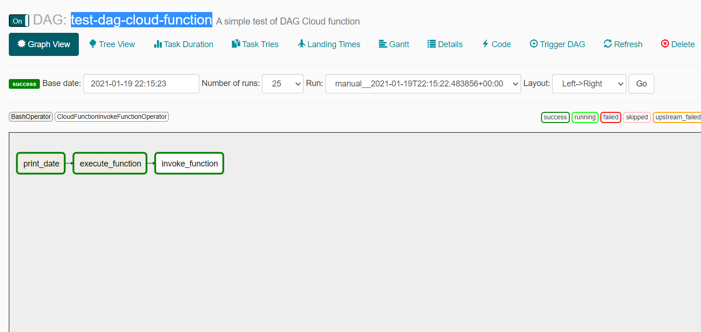

# Google Composer

Google Composer es un servicio en la nube de Apache Airflow, por lo que para entender esto, debemos de primero conocer Apache Airflow.

## Conceptos generales de Apache Airflow

De acuerdo a la documentación,  Apache Airflow es una plataforma creada para crear, programar y monitorear workflows (flujos de trabajo) mediante programación Python.

Esta cuenta con una interface web moderna que permite al usuario monitorear, programar y manejar los workflows definidos.

Airflow proporciona muchos operadores plug-and-play que están listos para ejecutar sus tareas en Amazon Web Services, Microsoft Azure, **Google Cloud Platform** y muchos otros servicios de terceros.

A continuación vamos a mencionar los conceptos principales que se deben de tener en cuenta:

- **DAGs (Directed Acyclic Graph):** es un script en Python, el cual permite representar una colección de tareas que se quieren ejecutar, organizar y monitorear (workfloads). En esta se definen las relaciones, dependencias de las tareas, además de sus reglas de ejecución. Estas son representadas gráficamente en una interface web mediante grafos acíclicos dirigidos.

 - **Default Arguments (Parámetros por defecto):** este es un diccionario que es pasado como argumento al DAG. Esto facilita la aplicación de un parámetro común a muchos operadores sin tener que escribirlo muchas veces. (Una tarea se define por medio de la implementación de un Operador, el cual va a ser explicado más adelante).

 - **Tasks (Tareas):** define una unidad de trabajo dentro de un DAG. Estas son representadas como un nodo en el grafo del DAG. Cada tarea es una implementación de un Operador, por ejemplo, un PythonOperator para ejecutar algún código de Python, o un BashOperator para ejecutar un comando Bash.

 - **Relations between Tasks (Relación entre tareas):** estas permiten definir las relaciones de las tareas del DAG.


 - **Operators (Operadores):** mientras que los DAGs describen cómo ejecutar un flujo de trabajo, los operadores determinan lo que realmente hace una tarea. Un operador describe una sola tarea en el workflow.

    Airflow proporciona muchos operadores integrados para muchas tareas comunes como: **BashOperator (ejecuta un comando Bash)**, PythonOperator, EmailOperator, etc. Para consultar toda la lista de Operadores disponibles, revise los siguientes enlaces: [Enlace a Operadores](https://airflow.apache.org/docs/apache-airflow/stable/python-api-ref.html#operators) y [Enlace a Operadores de GCP](https://airflow.apache.org/docs/apache-airflow-providers-google/stable/operators/cloud/index.html).

    El presente [repositorio](https://github.com/apache/airflow/tree/master/airflow/providers/google/cloud/example_dags/) permite ver distintos ejemplos para integrar con las aplicaciones de GCloud.
 

## Crear un ambiente en GCloud

1. Habilitar el API de Cloud Composer


2. Crear ambiente

    El sistema tarda aproximadamente 25 minutos en crear tu entorno.

    - Por la web de GCloud
    

    - Por comando CLI
        ```bash
        gcloud composer environments create ENV_NAME --location LOCATION
        ```

3. Definir los workflows usando los DAGs

    Como se mencionó antes, debemos de escribir nuestros DAGs usando Python.

    A continuación se presenta la estructura simple de uno:

    ```python
        #File:./test-dag-cloud-function.py

        # Librerias pertenecientes a Apache Airflow (obligatorio)  
        from datetime import timedelta

        import airflow
        from airflow import DAG
        from airflow.utils import dates

        #Se importan los tipos de operadores que se van a usar

        #Este permite ejecutar comandos bash
        from airflow.operators.bash_operator import BashOperator

        #Este Operador permite integrarse con los clouds functions que hay en el proyecto
        from airflow.providers.google.cloud.operators.functions import (
            CloudFunctionDeleteFunctionOperator,
            CloudFunctionDeployFunctionOperator,
            CloudFunctionInvokeFunctionOperator
        )

        # Definición de parámetros por defecto
        default_args = {
            'owner': 'aronlo',
            'start_date': airflow.utils.dates.days_ago(0), #Cuando comienza a correr ese workflow
            # 'end_date': datetime(2018, 12, 30), #Al omitir esto, corre indefinidamente
            'depends_on_past': False,
            'email': ['aron.lo.li@hotmail.com'],
            'email_on_failure': False,
            'email_on_retry': False,
            # If a task fails, retry it once after waiting
            # at least 5 minutes
            'retries': 1,
            'retry_delay': timedelta(minutes=5),
        }

        #Instanciamiento del objeto DAG
        dag = DAG(
            'test-dag-cloud-function',  #Nombre del DAG
            default_args=default_args,  #Se le agregan los parametros por defecto
            description='A simple test of DAG Cloud function',
            # Continue to run DAG once per day
            schedule_interval=timedelta(days=1), #Se agrega una programación
        )

        # t1, t2 and t3 are examples of tasks created by instantiating operators

        #Esta tarea 1 se encarga de ejecutar el comando bash: date
        t1 = BashOperator(
            task_id='print_date',
            bash_command='date',
            dag=dag)


        #Esta tarea 2 se encarga de usar el cli de Gcloud para invocar una funcion desplegada en el interior del projecto
        t2 = BashOperator(
            task_id ='execute_function',
            bash_command='gcloud functions call hello --region us-central1',
            dag=dag)


        #Esta tarea 3 se encarga de hacer lo mismo que el anterior, solo que invoca la funcion directamnete usando los Operadores de Apache Airflow.

        t3 =  CloudFunctionInvokeFunctionOperator(
                task_id="invoke_function",
                project_id="alicorp-test",
                location="us-central1",
                input_data={},
                function_id="hello",
                dag=dag)

        #Esto permite definir la dependencia de las tareas
        t1 >> t2 >> t3

    ```

4. Subir y desplegar nuestros DAGs en el ambiente de Google Composer

    - Por la web de GCloud
        
        Los archivos python (referenciándonos a los DAGs) son almacenados en un bucket creado automaticamente por Google.

        Para ver el bucket, podemos consultarlo usando la interfase web de Google.
        Proyecto > Composer > Carpeta de DAGs

        
        
        

        Así como si fuera Google Drive, subimos nuestros archivos python y automáticamente Google Composer lo desplegaría (suele demorar algunos minutos para que esté disponible). Para actualizar los DAGs se haría el mismo proceso.

    - Por comando CLI

        Este comando serviría para desplegar nuestro DAG (test-dag-cloud-function) en el Google Composer.

        ```bash
        gcloud composer environments storage dags import --environment composer-alicorp-test-env-1 --location us-east1 --source test-dag-cloud-function.py
        ```
5. Eliminar los DAGs en el ambiente de Google Composer
    - Por la web de GCloud
        
        Asi como se agregaron los archivos DAGs en el bucket (como si fuera google Drive), simplemente se seleccionan los archivos y se oprime el boton eliminar.

        

        Para el caso de **eliminar** el archivo en el bucket, tendremos que también manualmente eliminar el DAG de la web, ya que Apache Airflow maneja cierta metadata, el cual hará que el DAG siga apareciendo, pese a que lo eliminamos del bucket.
        

    - Por comando CLI

        ```bash
        gcloud composer environments storage dags delete --environment ENVIRONMENT_NAME --location LOCATION DAG_NAME.py
        ```
        Para eliminar la metadata que se menciono anteriormente, se ejecuta tambíen el siguiente comando:
        ```bash
        gcloud composer environments run --location LOCATION ENVIRONMENT_NAME delete_dag -- DAG_NAME
        ```


## Interface Web de Google Composer

Para acceder a la interface web de Apache Airflow, se debe de ingresar a la siguiente ruta: Proyecto > Composer > Servidor web de Airflow


Esta presenta distintas opciones como el monitoreo de las tareas, programación, ejecución de DAGs específicos, entre otros.


Si le damos click a un DAG en específico como por ejemplo el test-dag-cloud-function, podemos ver en más detalle las tareas que tiene programada. Inclusive, podemos ver en qué estado se encuentran cada tarea. Como vemos, tienen color verde, por lo que indíca que fueron ejecutadas correctamente.


Existe una opcion llamada "Graph View", que nos permite ver el grafo definido en el DAG.




Si se desea ver los logs de una tarea ejecutada en específico, se tiene que hacer click como se muestra en las siguientes imágenes:


